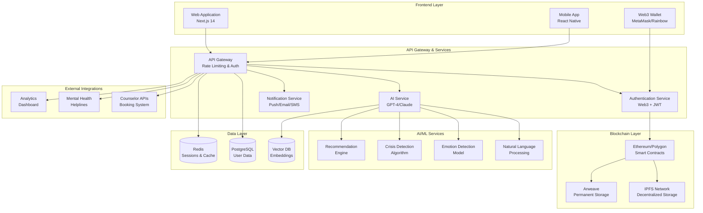
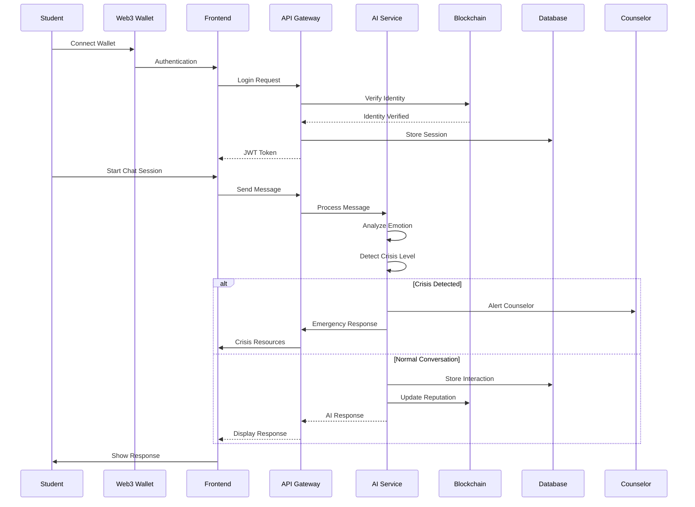
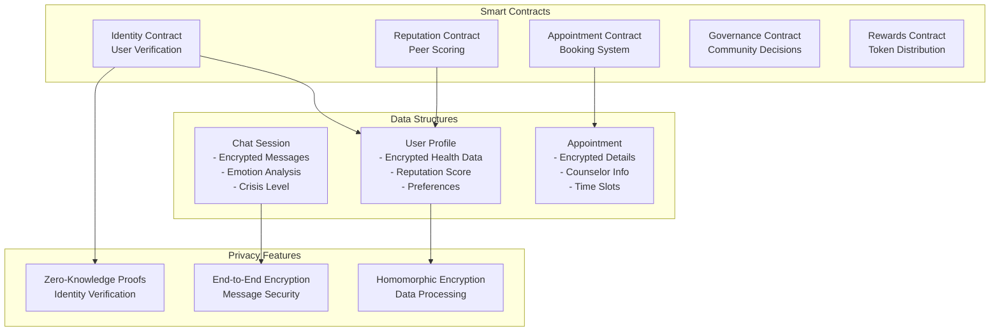
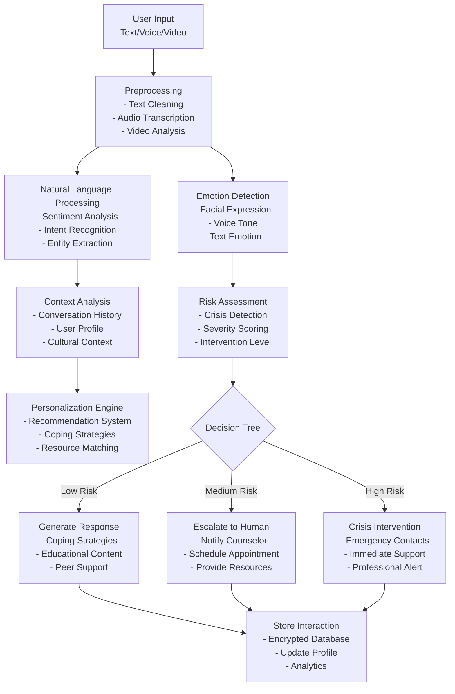
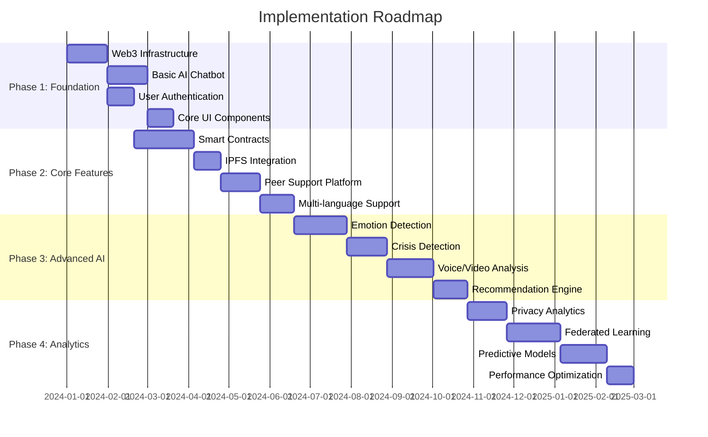
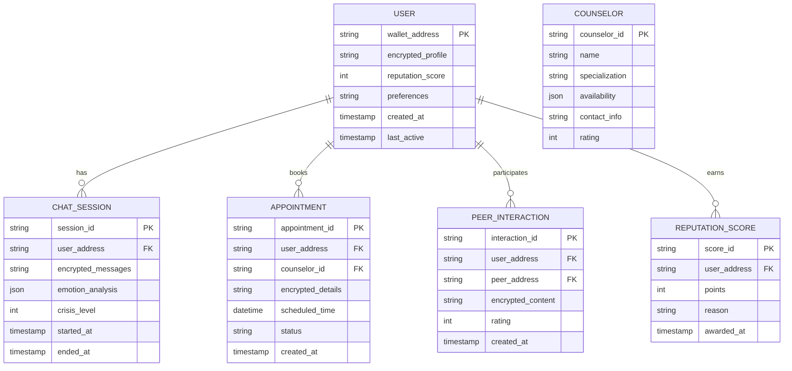
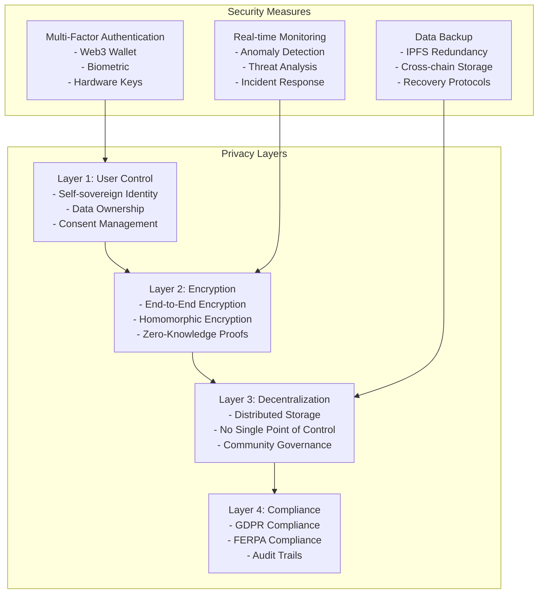

# Advanced Decentralized Mental Health Support System - Detailed Analysis

## 1. System Architecture Overview

## 1. High-Level System Architecture

## 2. Data Flow Pipeline

## 3. Smart Contract Architecture

## 4. AI Processing Pipeline

## 5. Implementation Pipeline & Phases

## 6. Data Structures & Database Schema

## 7. Security & Privacy Architecture

## 8. Technical Specifications

### Core Technologies Stack:

**Frontend:**
- TypeScript for type safety
- Tailwind CSS for styling
- Web3Modal for wallet integration
- Socket.io for real-time communication

**Backend:**
- Node.js with Express.js
- Prisma ORM with PostgreSQL
- Redis for caching and sessions
- Web3.js/Ethers.js for blockchain interaction

**Blockchain:**
- Ethereum/Polygon for smart contracts
- IPFS for decentralized storage
- Arweave for permanent data archiving
- Solidity for smart contract development

**AI/ML:**
- OpenAI GPT-4 or Anthropic Claude
- Hugging Face Transformers
- TensorFlow.js for client-side processing
- Custom emotion detection models

**Infrastructure:**
- Docker for containerization
- Kubernetes for orchestration
- AWS/GCP for cloud hosting
- CDN for global content delivery

[1 tool called]

## 9. Key Features & Capabilities

### **Advanced AI Features:**
1. **Multi-Modal Analysis**: Text, voice, and video emotion detection
2. **Cultural Adaptation**: Region-specific mental health knowledge
3. **Crisis Detection**: Real-time risk assessment and intervention
4. **Personalized Recommendations**: AI-driven coping strategies
5. **Predictive Analytics**: Early warning system for mental health issues

### **Decentralized Benefits:**
1. **Data Ownership**: Students control their own mental health data
2. **Privacy by Design**: No central authority can access personal information
3. **Censorship Resistance**: Cannot be shut down by any single entity
4. **Global Accessibility**: Available worldwide without restrictions
5. **Community Governance**: Users participate in platform decisions

### **Scalability Features:**
1. **Multi-Institution Support**: Serve multiple colleges simultaneously
2. **Language Support**: Native support for regional languages
3. **Mobile-First Design**: Optimized for smartphone usage
4. **Offline Capabilities**: Basic features work without internet
5. **API Integration**: Connect with existing institutional systems

## 10. Success Metrics & KPIs

### **User Engagement:**
- Daily/Monthly Active Users
- Session Duration and Frequency
- Feature Adoption Rates
- User Retention Metrics

### **Mental Health Impact:**
- Crisis Intervention Success Rate
- Appointment Booking Conversion
- Peer Support Effectiveness
- User Satisfaction Scores

### **Technical Performance:**
- System Uptime and Reliability
- Response Time Metrics
- Data Privacy Compliance
- Security Incident Response

